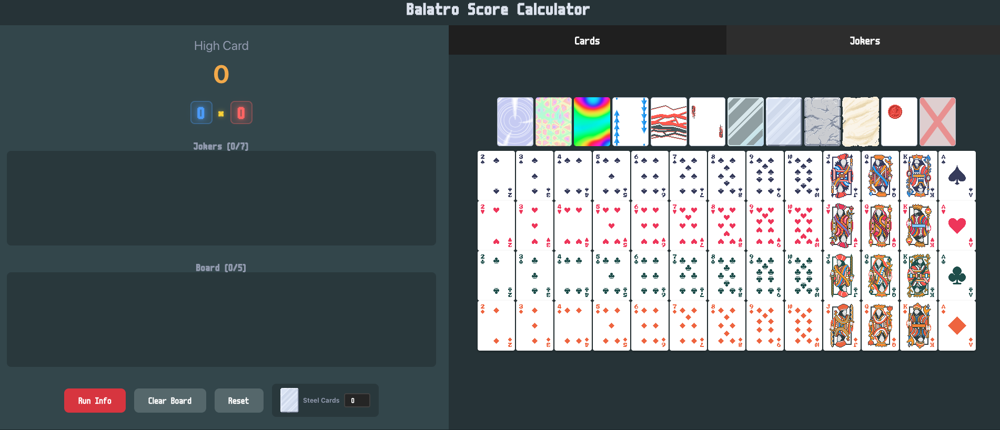

# Balatro Calculator

  <strong>Live Demo</strong>: <a href="https://www.balatrocalculators.com/">www.balatrocalculators.com</a>

A web-based score calculator for Balatro, the poker roguelike game. Calculate exact scores for any hand configuration with jokers, enhancements, editions, and game modifiers.

## About

This calculator simulates Balatro's scoring mechanics, allowing players to:

- Build hands with custom ranks, suits, enhancements, and editions
- Add up to 5 jokers and configure their effects
- Apply game modifiers (Plasma Deck, Four Fingers, Splash, etc.)
- Adjust hand levels to simulate planet card upgrades
- View detailed score breakdowns showing how each element contributes to the final result

The calculator follows the exact scoring formula from the game: Hand Evaluation → Base Score → Card Scoring → Enhancements → Joker Effects → X Multipliers → Final Score (chips × mult).
